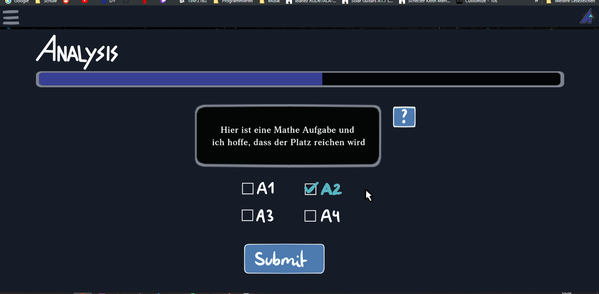
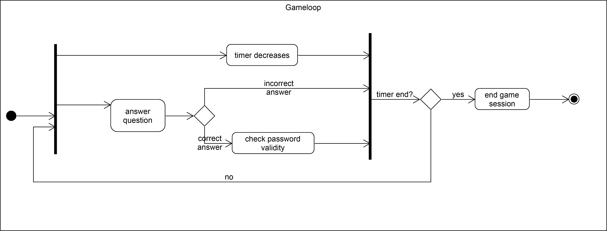

## 1. Brief Description
This usecase allows the user to play the game where they solve math problems under time pressure to earn levels and rewards.
## 2. GUI Mockup
### 2.1. First Mockup
</img>

### 2.2. Reworked Mockup
</img>

</img>

## 3. Flow of Events
</img>
## 4. Special Requirements
/ 
## 5. Preconditions
1. The user is logged in
2. The user starts a game 
See [specification file](../../Planning/Gameplay/Game%20Loop.md) for more information.
## 6. Postconditions
1. The stat system tracks the game progress
2. the player earns rewards based on their performance
## 7. Effort Estimation
