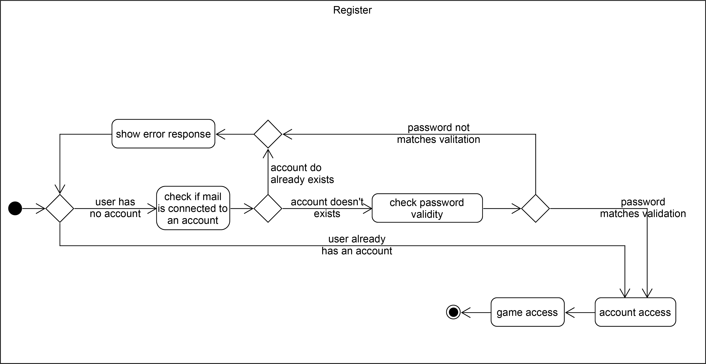

## 1. Brief Description
This use case will allow a user to create a new account.
## 2. GUI Mockup
</img>

## 3. Flow of Events
</img>

## 4. Special Requirements
No account is already registered to the user's email
## 5. Preconditions
1. The user is not logged in yet
2. The user visits the register page
3. The chosen Passwords fits the requirements (min 1 Uppercase, min 1 Lowercase, min 1 Digit, min 1 Non-Alphabetic Character, min 6 Characters)
## 6. Postconditions
1. The Backend creates the new account, returning errors on collisions
2. The user is now logged in to the newly created account
## 7. Effort Estimation
13 Story Points
