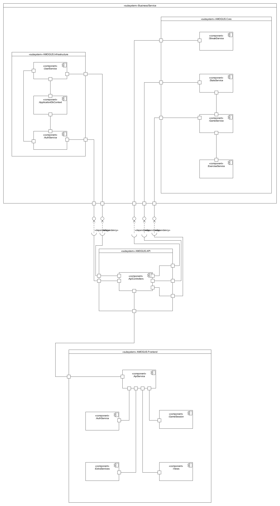

# SAD
## Software Architecture Documentation

## 1. Introduction

### 1.1 Purpose

This software architecture document provides a comprehensive overview of the architecture of the project AMOGUS. It serves as a communication medium between the software architect and other project team members regarding architecturally significant decisions which have been made.

### 1.2 Scope

This document defines the architecture of AMOGUS. It is directly related to the ABBA-Scheme and the ASR.

### 1.3 Definitions, Acronyms and Abbreviations

- **AMOGUS**: the project acromym for **A**dvanced **M**athmetic **O**perations **A**nd **G**eometrics **U**nder **S**tress

- **ABBA-Scheme**: the **A**mogus **B**asic **B**ackend **A**pi defines the internal backend architecture.

### 1.4 References

Figures:

- [Fig. 0](./Class%20Diagram.md)

- [Fig. 1](./Process%20Diagram.md)

- [Fig. 2](./Deployment%20Diagram.md)

- [Fig. 3](./Component%20Diagram.md)

Documents:

- [ABBA-Scheme](./ABBA%20Structure.md)

- [DB Concept](./Database%20Concept.md)

### 1.5 Overview

The following sections describes the architecture more detailed.

1. [Introduction](#1-introduction)
   
   1.1 [Purpose](#11-purpose)
   
   1.2 [Scope](#12-scope)
   
   1.3 [Definitions, Acronyms and Abbreviations](#13-definitions,-acronyms-and-abbreviations)
   
   1.4 [References](#14-references)
   
   1.5 [Overview](#15-overview)

2. [Architectural Representation](#11-purpose)

3. [Architectural Goals and Constrains](#3-architectural-goals-and-constraints)

4. [Use Case View](#4-use-case-view)
   
   4.1 [Use Case Realizations](#41-use-case-realizations)

5. [Logical View](#5-logical-view)

6. [Process View](#6-process-view)

7. [Deployment View](#8-deployment-view)

8. [Implementation View](#8-implementation-view)
   
   8.1 [Overview](#81-overview)
   
   8.2 [Layers](#82-layers)

9. [Data View](#9-data-view-(optional))

10. [Size and Performance](#10-size-and-performance)

11. [Quality](#11-quality)

## 2. Architectural Represantation

For AMOGUS the basic architecture is split into services:

- User Service: all userbased operations (roles, delete)

- Auth Service: authorization of users (login and register)

- Stats Service: get and update stats of a user

- Exercise Service: get and validate exercises

- Game Service: orchestrates the exercises and stats

- Streak Service: check current streak and update if necessary

## 3. Architectural Goals and Constraints

In this section, all software requirements and objectives relevant to AMOGUS that influence the architecture are covered.

- the architecture should prevent data manipulation via JavaScript

- the architecture should ensure account security

- the architecture should ensure easy changeability and modularization

- easy deployment of individual components should be possible

- backend and frontend should be seperated to further decouple the application

- to further simplify the deployment, the frontend and backend are deployed in separate docker containers

Special constraints that may apply:

- small team with little experience 

- small amount of time for implementation

## 4. Use-Case-View
Following Use-Cases are found in AMOGUS:  

- Login / Register
- Track process with stats view
- Practice Math with a game session
- Manage exercises as an admin

### 4.1 Use-Case Realizations
Use-Case Realization for [login.](../../Requirements/Use%20Case%20Realization%20Specification/Login%20UCRS.md) 
Use-Case Realization for [register.](../../Requirements/Use%20Case%20Realization%20Specification/Register%20UCRS.md)

## 5. Logical View

Fig. 0

## 6. Process View

Fig. 1

## 7. Deployment View

Fig. 2

## 8. Implementation View

### 8.1 Overview

AMOGUS implementation view has 4 Layers:

- Infrastructure
- API
- Core
- Frontend

The first three together is the backend. 

The API layer has the ApiControllers components which use dependency injection for the UserService and the Authservice in the Infrastructure layer as well as the StreakService, StatsService and GameService in the Core layer. It's also the communication point for the ApiService in the Frontend layer.

Within the Infrastructure layer the UserService and the AuthService both communicate with each other and use the ApplicationDbContext. The GameService in the Core layer uses the ExerciseService and communicates with the StatsService. All the services in the Frontend layer use the ApiService to be able to communicate with the API layer.

### 8.2 Layers

Fig. 3

## 9. Data View

Data, such as userdata and session data, will be stored using a database. During development AMOGUS will store it's data in an SQLite and for production it will use MariaDB. 

The db-concept can be seen [here](./Database%20Concept.md).

Originally the complex questions from a session would also be stored in the database. For simplicity reasons and to reduce data in the database this idea was discarded. The 'Questions'-table (as seen in the original db-concept) is no longer part of the database. 
Instead, the complex questions will be recorded as JSON objects which can easily be modified.

## 10. Size and Performance

The frontend performance is most likely going to stay in a efficent state. As most of the logic is rather simple and just provides/generates some basic information. Other than that the design choice will take a small percentage of the performance. So our goal is to stay efficient and don’t over engineer the frontend.
The backend  handles the major data processing and generation for our questions, therefore we can’t prevent some size and performance issues.
Some questions simply can’t be generated in a reasonable time so we will  use some auto generated questions mixed with generated ones to keep our performance as good as possible. This also describes our goal for the backend, to use as low performance as possible.
Our database will linearly scale with the amount of users and questions, which allows us to regulate our size concerns. In case we get more users than expected we can easily extend our Hardware. :D
Our general Goal is to reach the best UX possible, thus we should keep in mind that a long waiting period might lose the interest of each user. To prevent this issue we target a maximum waiting period of 2s on initial load and whilst on the page about 1s.

## 11. Quality

We are trying to ensure a specific quality-standard by introducing multiple architecture tactics concerning the design attribute Modifiability.

- AMOGUS will follow a service based architecture to enforce modularization and increase cohesion, hence making modifications more centralized and independent.

- Coupling will be reduced by following the [ABBA-Scheme](./ABBA%20Structure.md) and only allowing communication via well defined interfaces.

- Backend and frontend will be completely seperated (only communicating through a REST-API) to further decouple the application.

- Backend and frontend will be deployed in different docker containers therefore making deployment easier.