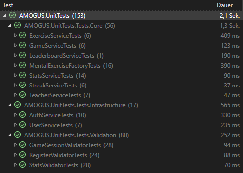
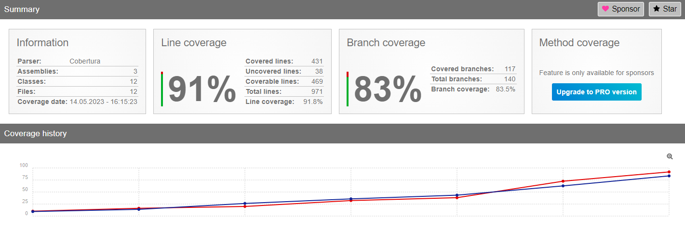
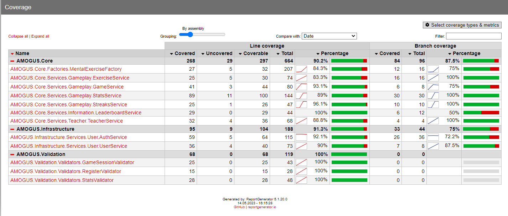

# Test Report

## Introduction
This document gives an overview of the testing activities of the __AMOGUS__ project. It will be extended in further development and testing.

## Test Strategy
We will perform Unit tests in our C# Backend for all major Service implementations and Validators.
These Unit tests will be executed on every push to our repo by our Github Actions CI workflows.

Furthermore there will be Validation testing, where we will give a demo to some people to test the general gameplay and provide us some form of "manual e2e tests"

> For more information look at our [testplan](https://cumgroup.github.io/AMOGUS/Developer%20Docs/4.%20Testing/Testplan/).

## Test plan
> For more information look at our [testplan](https://cumgroup.github.io/AMOGUS/Developer%20Docs/4.%20Testing/Testplan/).

## Test cases
> To see all unit test cases, look at our [testplan](https://cumgroup.github.io/AMOGUS/Developer%20Docs/4.%20Testing/Testplan/).

## Test Results
In the process of writing our unit tests, 3 bugs where found (and 2 minor improvements).

1. **UserService - DeleteUserAsync()** <br>
    - Severity: High 
    - Test: DeleteUserAsync_WhenGivenAUserId_AndEverythingIsFine_ReturnTrue()
    - Reason for Error:
    Missing “!” in first if-statement. Method returns exception when everything is alright.
        ```csharp
        if (await DeleteUserHistoryAsync(userId)) {
            return new UserOperationException("Failed deleting user.");
        }
        ```
    - Solution: Added missing “!”
<br><br><br>
2. **MentalExerciseFactory - CalcAnswer()**
    - Severity: Low 
    - Test: CheckAnswer_WhenGivenAnswer_AndQuestionIsRandomMental_AndAnswerIsNotCalculable_ReturnsFalse()
    - Reason for Error: testAnswer contained ‘x' in Exercise attribute which was set to “test exercise” which lead the CalcAnswer Method to try and solve it with the AngouriMath library. Since “test exercise” isn’t solvable it threw the SolveRequiresStatementException. This exception is not handled.
        ```csharp
        public string CalcAnswer(string question) {
            if (question is null)
                return string.Empty;
            Entity expr = question;
            try {
                if (question.Contains('x')) {
                    var set = expr.Solve("x");
                    if (set is Entity.Set.FiniteSet finiteset)
                        expr = finiteset.First();
                    expr = set;
                }
                return expr.Simplify().ToString();
            }
            catch (CannotEvalException) {
                return string.Empty;
            }
        }
        ```
    - Solution: Added second catch clause
        ```csharp
        catch (SolveRequiresStatementException) {
            return string.Empty;
        }
        ```
        <br><br><br>
3. **MentalExerciseFactory - Median()**
    - Severity: Low
    - Test: Median_ReturnsMedian_ForSortedArrayWithEvenCount()
    - Reason for Error: Median implementation was wrong
        ```csharp
        private static double Median(int[] arr) {
            Array.Sort(arr);
            double mid = arr.Length / 2d;
            if (mid == (int) mid)
                return arr[(int) mid];
            return (arr[(int) mid] + arr[Math.Min((int) mid + 1, arr.Length - 1)]) / 2d;
        }
        ```
        Median should return the midpoint if the length is not divisible by 2.
        So the condition has to be negated.
    - Solution: Fixed the median implementation
        ```csharp
        internal static double Median(int[] arr) {
            Array.Sort(sortedArr);
            int mid = sortedArr.Length / 2;
            if (sortedArr.Length % 2 != 0)
                return sortedArr[mid];
            return (sortedArr[mid] + sortedArr[Math.Max(Math.Min(mid - 1, sortedArr.Length - 1), 0)]) / 2d;
        }
        ```
        <br><br><br>
4. **Improvement: return early from Median calculation**
    - Severity: None
    - Median of an empty array or with a single element should return earlier
    - Solution: Added early returns
        ```csharp
        internal static double Median(int[] arr) {
            if (arr.Length == 0)
                return 0;
            if (arr.Length == 1)
                return arr[0];
            Array.Sort(sortedArr);
            int mid = sortedArr.Length / 2;
            if (sortedArr.Length % 2 != 0)
                return sortedArr[mid];
            return (sortedArr[mid] + sortedArr[Math.Max(Math.Min(mid - 1, sortedArr.Length - 1), 0)]) / 2d;
        }
        ```
        <br><br><br>
5. **Improvement: Do not mutate the input array in Median calculation**
    - Severity: Low 
    - Solution: clone array before sorting
        ```csharp
        internal static double Median(int[] arr) {
            if (arr.Length == 0)
                return 0;
            if (arr.Length == 1)
                return arr[0];
            int[] sortedArr = (int[])arr.Clone();
            Array.Sort(sortedArr);
            int mid = sortedArr.Length / 2;
            if (sortedArr.Length % 2 != 0)
                return sortedArr[mid];
            return (sortedArr[mid] + sortedArr[Math.Max(Math.Min(mid - 1, sortedArr.Length - 1), 0)]) / 2d;
        }
        ```


These are the overall test results:



<br>
<br>


## Metrics
As mentioned above, 3 bugs where found (and 2 minor improvements).<br>
Time to fix all the issues: 30m

Achieved code coverage:




## Recommendations
Unit testing with xUnit.Net and Moq is easy to do and get up and running.<br>
Future projects should use a better solution to display the code coverage. For example [Codecov](https://about.codecov.io/) to display coverage in pull requests (for reference see [this](https://fibo952390745.wordpress.com/2023/05/04/week-13-ci-coverage-and-chores/)).

Furthermore a better solution to collect and document test cases (other than manual) should be practiced!

## Conclusion
To summarize, very few issues were detected. The found errors could be resolved very quickly and the overall software quality is very good!

