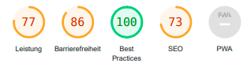
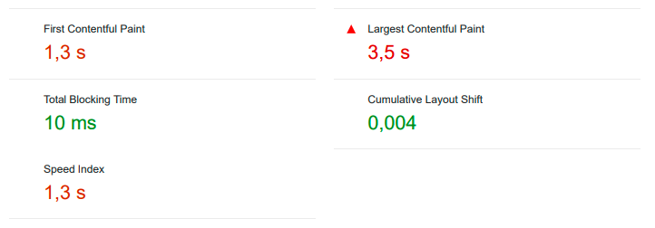
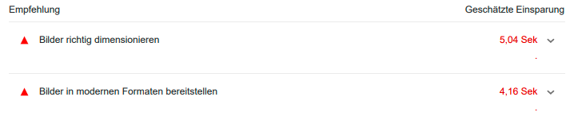
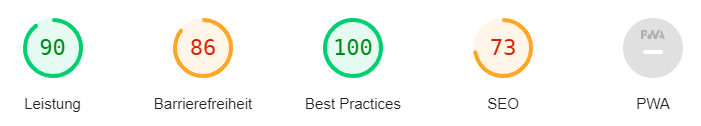
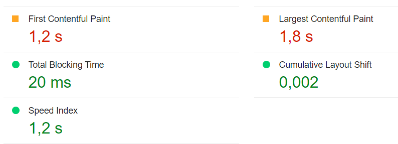
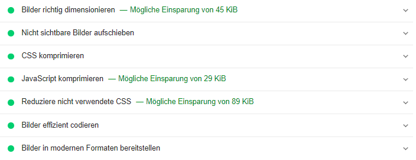
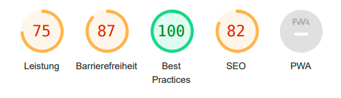
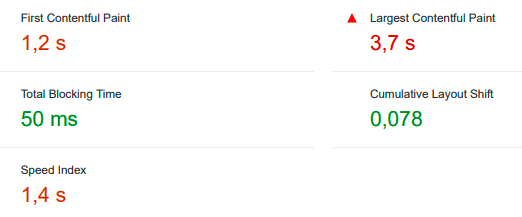
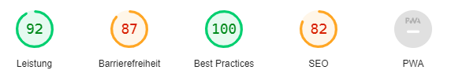
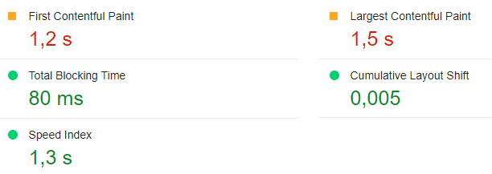

# Metrics

The following document provides an insight into the software metrics of the AMOGUS project. 

For the backend the source code complexity and the class coupling metrics are examined. AMOGUS is a web application, therefore the web application metrics are examined as well to give an insight to the frontend.

Software testing metrics are a result from the testing described in the [testplan](https://cumgroup.github.io/AMOGUS/Developer%20Docs/4.%20Testing/Testplan/).

 

## 1. Evaluation methods

In this section the methods used to collect the chosen metrics are described.

### 1.1. Source Code Complexity and Class Coupling

This projects source code complexity and class coupling are measured using the [inbuilt feauture](https://learn.microsoft.com/en-us/visualstudio/code-quality/code-metrics-values?view=vs-2022) of the IDE Visual Studio 2022. To evaluate these metrics the results from the calculation of the IDE are gathered on a class level. Visual Studio aggregates the metrics of the functions of a class and provides this as a result. For the assembly level the median of the results of all classes within that assembly is calculated to exclude outliers.

### 1.2. Web Application Metrics

The web application metrics are measured using the built in feature [Lighthouse](https://developer.chrome.com/docs/lighthouse/) in Google Chrome.

For this project this metric is measured in two rounds:
1. Before optimizing images.
2. After optimizing images. 

 

## 2. Results

In this section the results of the chosen metrics are displayed.

### 2.1. Source Code Complexity and Class Coupling

Median of the code complexity of the overall AMOGUS project:

|            |Code Complexity|Class Coupling|
|-|-|-|
|Project AMOGUS (median) | 5 |10|

The following tables show the calculated source code complexity and class coupling on a class level. They are grouped by the assemblies of AMOGUS.

  
assembly: AMOGUS VALIDATION

|            |Code Complexity|Class Coupling|
|-|-|-|
|assembly: AMOGUS VALIDATION (median) |1 |10|
|RegisterValidator| 1| 10|
|StatsValidator |1 |10|
|GameSessionValidator| 1| 10|
|AddValidators| 1 |2|

  
assembly: AMOGUS INFRASTRUCTURE

|            |Code Complexity|Class Coupling|
|-|-|-|
|assembly: AMOGUS INFRASTRUCTURE (median) |6 |17|
|DateTimeWrapper |3 |4|
|UserMedalRepository| 3| 13|
|RoleManagerWrapper |3 |15|
|GameSessionRepository| 5| 15|
|TokenFactory |6| 21|
|DependecyInjection| 6| 34|
|UserStatsRepository |9 |17|
|UserService |9 |18|
|UserManagerWrapper| 13 |16|
|ApplicationDbContext |16| 23|
|AuthService |22 |38|

  
assembly: AMOGUS CORE

|            |Code Complexity|Class Coupling|
|-|-|-|
|assembly: AMOGUS CORE (median) |4| 3|
|DependencyInjection| 2| 2|
|UserRoles |1 |0|
|Result |54 |11|
|Result<A>| 69 |12|
|ResultState |1| 0|
|AuthFailureException| 4| 3|
|RecordNotFoundException |1| 1|
|UserOperationException| 4 |3|
|IDateTime |2| 1|
|IJwtConfiguration |3| 0|
|IMailerConfiguration |4 |0|
|IQuestionRepoConfiguration| 1| 0|
|JwtConfiguration |7 |2|
|MailerConfiguration |9| 2|
|QuestionRepoConfiguration |3| 2|
|IApplicationDbContext |13 |8|
|IRoleManager |2 |3|
|IUserManager |12| 8|
|IExerciseFactory |2 |1|
|IExerciseService |3| 3|
|IGameService |3 |4|
|ILeaderboardService| 1| 2|
|ImailerService |2 |1|
|IQuestionFileAccessor| 7| 5|
|IStatsService |4 |6|
|IStreakService |2| 3|
|IGameSessionRepository| 4| 5|
|IUserMedalRepository |2 |3|
|IUserStatsRepository| 7| 5|
|ITokenFactory |4| 6|
|ITeacherService |4| 5|
|IAuthService |3 |6|
|IUserService |3| 4|
|LeaderboardApiModel| 7 |2|
|LeaderboardUserCorrectRatio |4| 0|
|LeaderboardUserStreak |4 |0|
|LoginApiModel |4| 0|
|LoginResultApiModel| 9| 2|
|RegisterApiModel |6 |0|
|UserApiModel |10 |1|
|UserStatsApiModel| 23| 8|
|CategoryType |1| 0|
|DifficultyType |1| 0|
|UserMedalType |1| 0|
|MailTextStatics| 1| 0|
|GameSession |24| 8|
|Question |17| 3|
|UserMedal| 10| 9|
|UserStats| 21| 6|
|MentalExerciseModel| 16 |2|
|MentalExerciseFactory| 41| 20|
|ExerciseService |16| 12|
|GameService |9| 23|
|QuestionFileAccessor |16| 24|
|StatsService |24| 29|
|StreaksService |8| 10|
|LeaderboardService |8| 14|
|MailerService |7| 19|
|TeacherService |7| 17|
|ApplicationUser| 2 |1|

  
assembly: AMOGUS BENCHMARKS

|            |Code Complexity|Class Coupling|
|-|-|-|
|assembly: AMOGUS BENCHMARKS (median)| 7| 6|
|Program |2| 3|
|MentalExerciseFactoryBenchmarks| 7| 6|
|ExerciseServiceBenchmarks |29| 21|

  
assembly: AMOGUS API

|            |Code Complexity|Class Coupling|
|-|-|-|
|AMOGUS API |5| 19|
|Program |4| 36|
|UserController |14 |25|
|TeacherController| 7| 23|
|StatsController| 8| 19|
|InformationController |2| 10|
|HealthController |1 |6|
|GameController |10| 24|
|AuthController |3| 15|
|StreakUpdateScheduler| 5| 14|
|SendMailServiceScheduler |5| 16|
|DependencyInjection |2| 23|

 
Looking at the results of these metrics it's possible to say that the code complexety is quite high with the values ranging from 4 to 7 in the assembly level. That could be explained due to a lot of validations and condition checking. 
As for the class coupling the high values could originate from a lot of utility classes (the services and repositories) being used throughout the project.

 
Both high values could also be because of the class level aggregation that Visual Studio does.

 

### 2.2.  Web Application Metrics

The web application metrics are measured twice. The first time measuring before all the images on the page were optimized and the second measureing after optimizing the images.

*I.) Landingpage*  

</img> 
</img>

As seen in the result, the landing page of AMOGUS doesn not score as well in performance as it does in best practices and the largest contentful paint takes up to `3,5s` to build. 

</img>

The main issue for the performance is statet in Lighthouse's recommendations as seen above: the images are too big. After scaling the logo, the parallax background and the badges down and changing the fileformats to `svg` and `webp` the performance increased. The largest contentful paint now only takes up `1,8s` instead of `3,5s`. Results after scaling images down:

</img>
 
</img>
 
</img>

In the last image it is seen that the images in the landingpage now pass the tests from Lighthouse.

The full Lighthouse test results for the landingpage can be found here:  
- [First results](https://cumgroup.github.io/AMOGUS/Developer%20Docs/5.%20Metrics/Web%20Application%20Metrics/First%20Results/Landingpage/)
- [Second results](https://cumgroup.github.io/AMOGUS/Developer%20Docs/5.%20Metrics/Web%20Application%20Metrics/Second%20Results/Landingpage/) (after scaling images down)

*II.) Statistics page*  

The statistics page shows similar results to the landingpage.

</img>
 
</img>

Due to badge having a big size and high resolution the largest contentful paint takes up `3,7s`. 
After scaling down the badges and changing their format, performance in loding the statistics page significantly increased:

</img>
 
</img>

The full Lighthouse test results for the statistics page can be found here:  
- [First results](https://cumgroup.github.io/AMOGUS/Developer%20Docs/5.%20Metrics/Web%20Application%20Metrics/First%20Results/Statisticspage/)
- [Second results](https://cumgroup.github.io/AMOGUS/Developer%20Docs/5.%20Metrics/Web%20Application%20Metrics/Second%20Results/Statisticspage/) (after scaling images down)

*III.) How-To-Play page*  

### 2.3. Software Testing Metrics

All about the software testing metrics and the results of the testing can be found in the [Test Report](https://cumgroup.github.io/AMOGUS/Developer%20Docs/4.%20Testing/zTest%20Report/).

