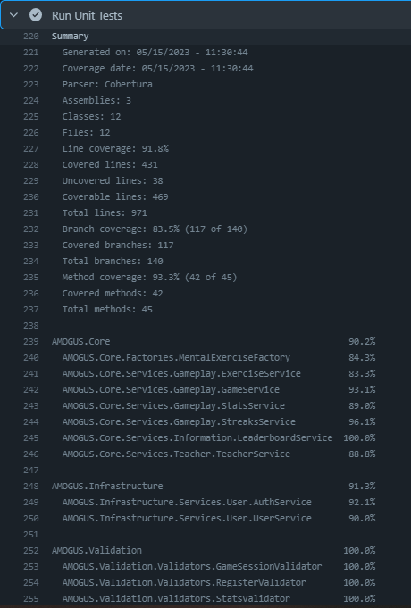

# CI/CD Documentation

## CI Workflows
On every Pull Request to the main branch, that edits the `./src/` folder, following Workflows get executed.

- [Build the api and the ui](https://github.com/CUMGroup/AMOGUS/blob/main/.github/workflows/build-on-pullrequest.yaml) (check if everything compiles right)
```yaml
name: Build on Pull Request

on:
  pull_request:
    branches: [ main ]
    paths:
      - src/**

jobs:
  build:
    runs-on: ubuntu-latest
    steps:
    - name: Checkout code
      uses: actions/checkout@v2

    - name: Setup .NET Core
      uses: actions/setup-dotnet@v1
      with:
        dotnet-version: '6.0.x'

    - name: Setup Node.js
      uses: actions/setup-node@v2
      with:
        node-version: '14.x'

    - name: Install dependencies
      run: |
        cd src/api/AMOGUS.Api
        dotnet restore
        cd ../../ui
        npm install

    - name: Build
      run: |
        cd src/api/AMOGUS.Api
        dotnet build
        cd ../../ui
        npm run build
```
This workflow checks out the repository and tries to build the dotnet project and the angular project. If any of them fail, the workflow fails and the pull request gets rejected.

- [Run all Unit Tests](https://github.com/CUMGroup/AMOGUS/blob/main/.github/workflows/test-on-pullrequest.yaml)
```yaml
name: Test on Pull Request

on:
  pull_request:
    branches: [ main ]
    paths:
      - src/api/**

jobs:
  test:
    runs-on: ubuntu-latest
    steps:
    - name: Checkout code
      uses: actions/checkout@v2

    - name: Setup .NET Environment
      uses: actions/setup-dotnet@v1
      with:
        dotnet-version: '6.0.x'

    - name: Run Unit Tests
      run: |
        cd src/api/AMOGUS.UnitTests
        rm -rf coverage
        rm -rf TestResults
        dotnet tool install -g dotnet-reportgenerator-globaltool
        dotnet test --logger "console;verbosity=detailed" --collect:"XPlat Code Coverage"
        reportgenerator "-reports:TestResults/*/coverage*" "-targetdir:coverage" "-reporttypes:TextSummary" "-classfilters:-AMOGUS.Core.Common*;-AMOGUS.Core.DataTransferObjects*;-AMOGUS.*.DependencyInjection;-AMOGUS.Core.Domain*;-AMOGUS.Infrastructure.Identity*;-AMOGUS.Infrastructure.Persistence*"
        cat coverage/Summary.txt
        rm -rf coverage
        rm -rf TestResults
```
This workflow triggers when the api gets edited in the pull request. It checksout our repository and runs all unit tests in the `AMOGUS.UnitTests` assembly.<br>
If any test fails the workflow fails and the pull request gets rejected.

Additionally, a code coverage report is generated that looks something like this.



## CD Workflows
When something gets pushed to the main branch two workflows could be triggered:
- [Deploy API](https://github.com/CUMGroup/AMOGUS/blob/main/.github/workflows/deploy-api.yaml) - When the `src/api` folder gets updated
```yaml
name: Build & Redeploy Api

on:
  push:
    branches: [ main ]
    paths:
      - src/api/**
    
jobs:
  build:
    runs-on: ubuntu-latest
    steps:
    - name: Checkout code
      uses: actions/checkout@v2
      
    - name: Setup .NET 6
      uses: actions/setup-dotnet@v1
      with:
        dotnet-version: '6.0.x'
        
    - name: Dependencies
      run: |
        cd src/api/AMOGUS.Api
        dotnet restore
        
    - name: Build
      run: |
        cd src/api/AMOGUS.Api
        dotnet build
  docker:
    name: Publish
    runs-on: ubuntu-latest
    needs: [build]
    env:
      REPO: ${{ secrets.DOCKER_REPO_API }}
    steps:
      - uses: actions/checkout@v2
      - name: Login to REPO
        run: docker login -u ${{ secrets.DOCKER_USER }} -p ${{ secrets.DOCKER_PASS }}
      - name: Build Image
        run: docker build -t $REPO:latest -t $REPO:${GITHUB_SHA::8} -f src/api/AMOGUS.Api/Dockerfile src/api
      - name: Publish Image
        run: docker push $REPO
        
  redeploy:
    name: Redeploy webhook call
    runs-on: ubuntu-latest
    needs: [docker]
    steps:
      - name: Deploy docker container webhook
        uses: joelwmale/webhook-action@master
        with:
          url: ${{ secrets.DEPLOY_WEBHOOK_URL_API }}
          headers: ${{ secrets.DEPLOY_WEBHOOK_HEADER_API }}
```
This workflow builds a docker image from the API, pushes it to our DockerHub repository and sends a webhook to our deployment script on our server.
- [Deploy UI](https://github.com/CUMGroup/AMOGUS/blob/main/.github/workflows/deploy-ui.yaml) - When the `src/ui` folder gets updated
```yaml
name: Build & Redeploy UI

on:
  push:
    branches: [ main ]
    paths:
      - src/ui/**
    
jobs:
  build:
    runs-on: ubuntu-latest
    steps:
    - name: Checkout code
      uses: actions/checkout@v2
      
    - name: Setup Node.js
      uses: actions/setup-node@v2
      with:
        node-version: '14.x'
        
    - name: Install dependencies
      run: |
        cd src/ui
        npm install
        
    - name: Build
      run: |
        cd src/ui
        npm run build
        
  docker:
    name: Publish
    runs-on: ubuntu-latest
    needs: [build]
    env:
      REPO: ${{ secrets.DOCKER_REPO_UI }}
    steps:
      - uses: actions/checkout@v2
      - name: Login to REPO
        run: docker login -u ${{ secrets.DOCKER_USER }} -p ${{ secrets.DOCKER_PASS }}
      - name: Build Image
        run: docker build -t $REPO:latest -t $REPO:${GITHUB_SHA::8} src/ui
      - name: Publish Image
        run: docker push $REPO
        
  redeploy:
    name: Redeploy webhook call
    runs-on: ubuntu-latest
    needs: [docker]
    steps:
      - name: Deploy docker container webhook
        uses: joelwmale/webhook-action@master
        with:
          url: ${{ secrets.DEPLOY_WEBHOOK_URL_UI }}
          headers: ${{ secrets.DEPLOY_WEBHOOK_HEADER_UI }}
```
This workflow builds a docker image from the AMOGUS UI, pushes it to our DockerHub repository and sends a webhook to our deployment script on our server.

## Serverside
The server uses the [Webhooks](https://github.com/adnanh/webhook
) package to create following endpoints

```json
[
	{
		"id": "amogus-redeploy-api",
		"execute-command": "redeploy-api.sh",
		"command-working-directory": "/root/amogus",
		"response-message": "Redeploying AMOGUS Api",
		"trigger-rule": {
			"and": [
				{
					"match": {
						"type": "value",
						"value": "<INSERT API KEY>",
						"parameter": {
							"source": "header",
							"name": "X-ApiKey"
						}
					}
				}
			]
		}
	},
	{
		"id": "amogus-redeploy-ui",
		"execute-command": "redeploy-ui.sh",
		"command-working-directory": "/root/amogus",
		"response-message": "Redeploying AMOGUS UI",
		"trigger-rule": {
			"and": [
				{
					"match": {
						"type": "value",
						"value": "<INSERT API KEY>",
						"parameter": {
							"source": "header",
							"name": "X-ApiKey"
						}
					}
				}
			]
		}
	}
]
```

When a request comes in (of course with the correct api key), it starts the build script which pulls the docker image from the DockerHub repo, stops the running container, prunes all remaining artifacts and runs the new container with all required environment variables.