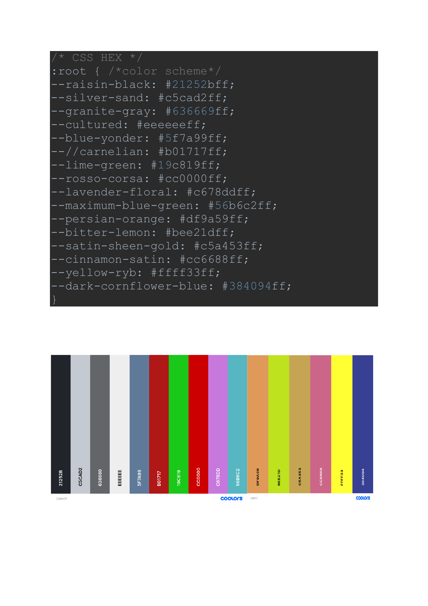
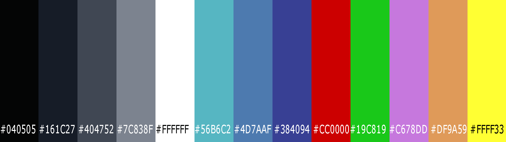

## First Color Scheme

## Rewampt Color Scheme (Version 2.0)

**Background colors:**  
> #040505  
> #161C27  
> #404752  
> #7C838F  

**Font color:**  
> #FFFFFF

**Highlight colors:**  
> #56B6C2  
> #4D7AAF  
> #384094  

**Pichart colors:**  
> #C678DD  
> #DF9A59  
> #FFFF33  

**Other colors:**  
> #CC0000 - wrong answer  
> #19C819 - correct answer