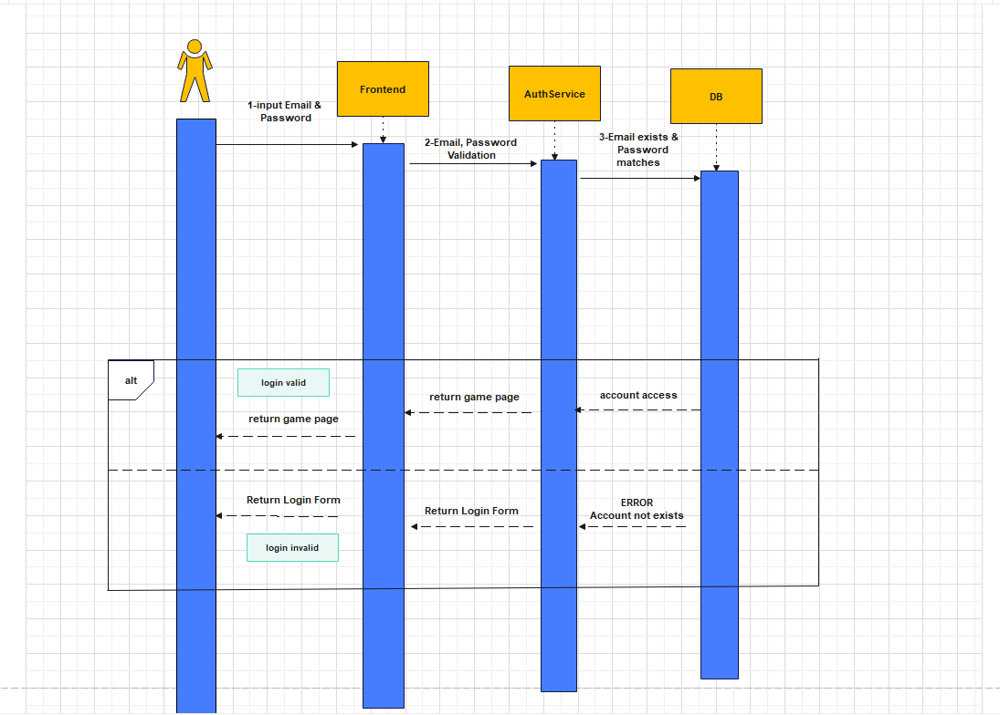

## Table of contents
- [Table of contents](#table-of-contents)
- [Introduction](#1-introduction)
    - [Purpose](#11-purpose)
    - [Scope](#12-scope)
    - [Definitions, Acronyms and Abbreviations](#13-definitions-acronyms-and-abbreviations)
    - [References](#14-references)
    - [Overview](#15-overview)
- [Flow of Events—Design](#2-flow-of-eventsdesign)
- [Derived Requirements](#3-derived-requirements)

## 1. Introduction
### 1.1 Purpose

this use-case-Realization Specification describes how a user who needs math parctics can login with an account information (email, password). 

### 1.2 Scope

### 1.3 Definitions, Acronyms, and Abbreviations
| Abbreviation  | Explanation                               |
|---------------|-------------------------------------------|
| PAMO          | Project AMOGUS - The name of the Project  |
| AMOGUS        | Advanced Mathematic Operations and Geometrics Under Stress |
| UCS           | Use Cases                                 |

### 1.4 References
| Title                                                         | Date       | Publisher |
|---------------------------------------------------------------|------------|-----------|
| [AMOGUS Blog](https://github.com/CUMGroup/AMOGUS/discussions) | 19.10.2022 | CUMGroup  |
| [Github](https://github.com/CUMGroup/AMOGUS/)                 | 19.10.2022 | CUMGroup  |

### 1.5 Overview

In the following the flow of events is described supported by a UMLSD. This document ends with the description of the derived requirements.

## 2. Flow of Events—Design 

Use Case Login Diagram

</img> 

## 3. Derived Requirements
- User Password/Email
- authorization-system
- Validate System

