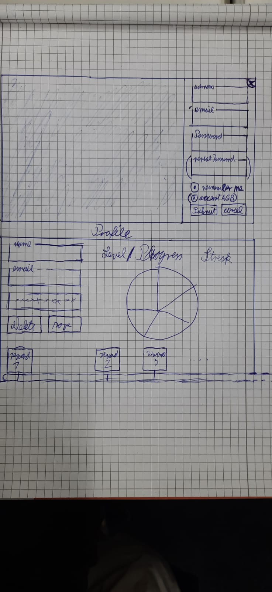

## 1. Brief Description
This use case allows the user to progress in the game by collecting levels from playing. New Levels yield rewards. 
## 2. GUI Mockup
</img>

## 3. Flow of Events
TBD
## 4. Special Requirements
/
## 5. Preconditions
1. The user logged in
2. The user plays games
3. The user collects levels by answering correctly 
## 6. Postconditions
The user gets rewards as shown in the Level [specification file](../../Planning/Gameplay/Level%20System.md)
## 7. Effort Estimation