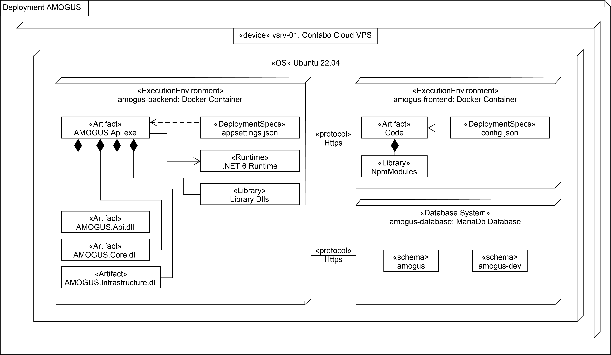

## 1. Introduction

### 1.1 Purpose

### 1.2 Scope

### 1.3 Definitions, Acronyms and Abbreviations

### 1.4 References

### 1.5 Overview

## 2. Architectural Represantation

## 3. Architectural Goals and Constraints

## 4. Use-Case-View

### 4.1 Use-Case Realizations

## 5. Logical View

### 5.1 Overview

### 5.2 Architecturally Significant Design Packages

## 6. Process View

## 7. Deployment View

## 8. Implementation View

### 8.1 Overview

### 8.2 Layers

## 9. Data View (optional)

## 10. Size and Performance

## 11. Quality

We are trying to ensure a specific quality-standard by introducing multiple architecture tactics concerning the design attribute Modifiability.

- AMOGUS will follow a service based architecture to enforce modularization and increase cohesion, hence making modifications more centralized and independent.

- Coupling will be reduced by following the [ABBA-Scheme](https://github.com/CUMGroup/AMOGUS/blob/main/documents/architecture/BackendArchitecture.pdf) and only allowing communication via well defined interfaces.

- Backend and frontend will be completely seperated (only communicating through a REST-API) to further decouple the application.

- Backend and frontend will be deployed in different docker containers therefore making deployment easier.
