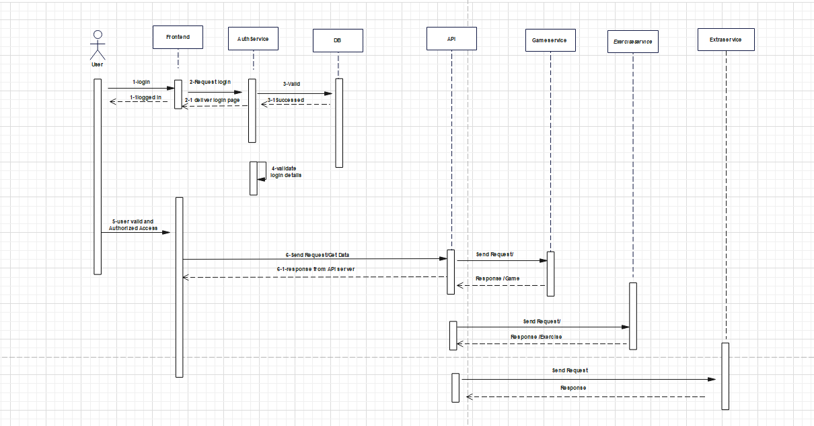

## 1. Introduction

### 1.1 Purpose

### 1.2 Scope

### 1.3 Definitions, Acronyms and Abbreviations

### 1.4 References

### 1.5 Overview

## 2. Architectural Represantation

## 3. Architectural Goals and Constraints

## 4. Use-Case-View

### 4.1 Use-Case Realizations

## 5. Logical View

### 5.1 Overview

### 5.2 Architecturally Significant Design Packages

## 6. Process View

## 7. Deployment View

## 8. Implementation View
### 8.1 Overview
AMOGUS implementation view has 4 Layers:
- Infrastructure
- API
- Core
- Frontend

The first three together is the backend. 

The API layer has the ApiControllers components which use dependency injection for the UserService and the Authservice in the Infrastructure layer as well as the StreakService, StatsService and GameService in the Core layer. It's also the communication point for the ApiService in the Frontend layer.

Within the Infrastructure layer the UserService and the AuthService both communicate with each other and use the ApplicationDbContext. The GameService in the Core layer uses the ExerciseService and communicates with the StatsService. All the services in the Frontend layer use the ApiService to be able to communicate with the API layer.

### 8.2 Layers

## 9. Data View (optional)
Data, such as userdata and session data, will be stored using a database. During development AMOGUS will store it's data in an SQLite and for production it will use MariaDB. 

The original db-concept can be seen [here](https://github.com/CUMGroup/AMOGUS/blob/main/documents/architecture/db_concept.pdf).

Originally the complex questions from a session would also be stored in the database. For simplicity reasons and to reduce data in the database this idea was discarded. The 'Questions'-table (as seen in the original db-concept) is no longer part of the database. 
Instead, the complex questions will be recorded as JSON objects which can easily be modified.

## 10. Size and Performance

## 11. Quality

We are trying to ensure a specific quality-standard by introducing multiple architecture tactics concerning the design attribute Modifiability.

- AMOGUS will follow a service based architecture to enforce modularization and increase cohesion, hence making modifications more centralized and independent.

- Coupling will be reduced by following the [ABBA-Scheme](https://github.com/CUMGroup/AMOGUS/blob/main/documents/architecture/BackendArchitecture.pdf) and only allowing communication via well defined interfaces.

- Backend and frontend will be completely seperated (only communicating through a REST-API) to further decouple the application.

- Backend and frontend will be deployed in different docker containers therefore making deployment easier.
