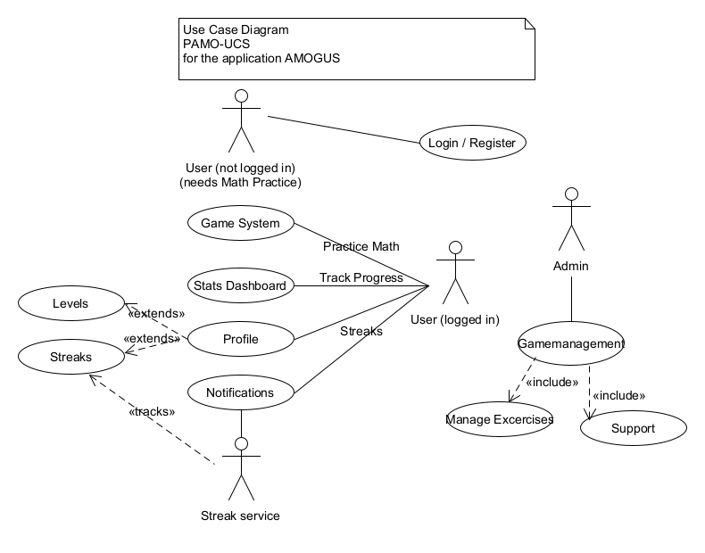

## Table of contents
- [Table of contents](#table-of-contents)
- [Introduction](#1-introduction)
    - [Purpose](#11-purpose)
    - [Scope](#12-scope)
    - [Definitions, Acronyms and Abbreviations](#13-definitions-acronyms-and-abbreviations)
    - [References](#14-references)
    - [Overview](#15-overview)
- [Overall Description](#2-overall-description)
    - [Vision](#21-vision)
    - [Use Case Diagram](#22-use-case-diagram)
	- [Technology Stack](#23-technology-stack)
- [Specific Requirements](#3-specific-requirements)
    - [Functionality](#31-functionality)
    - [Usability](#32-usability)
    - [Reliability](#33-reliability)
    - [Performance](#34-performance)
    - [Supportability](#35-supportability)
    - [Design Constraints](#36-design-constraints)
    - [Online User Documentation and Help System Requirements](#37-online-user-documentation-and-help-system-requirements)
    - [Interfaces](#38-interfaces)
    - [Licensing Requirements](#39-licensing-requirements)
- [Supporting Information](#4-supporting-information)

## 1. Introduction
### 1.1 Purpose
This document specifies the requirements of our application. It also describes nonfunctional requirements, designconstraints, and other factors necessary to provide a complete and comprehensive description of the requirements for AMOGUS.
### 1.2 Scope
AMOGUS is a web application for people to practice their Mathematic skills similar to the well-known language learning app Duolingo. Each User will be able to have an account in order to keep track of their progress. Admins will be able to manage the Exercises as well as giving support to the users [see Use-Case-Diagramm]. 
Planned Systems are:
- Gameplay System
- Streak System
- Level System
- Accounts
- Stats tracking

### 1.3 Definition, Acronyms and Abbreviations
| Abbreviation  | Explanation                               |
|---------------|-------------------------------------------|
| PAMO          | Project AMOGUS - The name of the Project  |
| AMOGUS        | Advanced Mathematic Operations and Geometrics Under Stress |
| UCS           | Use Cases                                 |

### 1.4 References
| Title                                                         | Date       | Publisher |
|---------------------------------------------------------------|------------|-----------|
| [AMOGUS Blog](https://github.com/CUMGroup/AMOGUS/discussions) | 19.10.2022 | CUMGroup  |
| [Github](https://github.com/CUMGroup/AMOGUS/)                 | 19.10.2022 | CUMGroup  |

### 1.5 Overview
This document provides an overview over the project, its use cases and requirements

## 2. Overall Description
### 2.1 Vision
AMOGUS is a web application for people to practice their Mathematic skills similar to the well-known language learning app Duolingo.
### 2.2 Use Case Diagram

### 2.3 Technology Stack
The technology used will be:
- Backend: ASP.Net Web API, Sqlite Database
- Frontend: Angular Web app
- IDE: Visual Studio 2022, Visual Studio Code
- Project Management: Jira, Github, Discord

## 3. Specific Requirements
### 3.1 Functionality
#### Accounts (Login, Registering, Profiles)
We want to let the user create their own account to track their progress, play games and get notified if they would lose their streak.
#### Game loop
This is the most important feature of our app. Here we will implement the main Excercises in a playful way. Players get a random Math problem from a specific category and can then try to solve it to get points and progress in the game. 
Currently planned categories are:
- Mental Arithmetic
- Analysis (with Differentiation and Integration)
- Algebra (with Matrices)
- Complex Number Arithmetic

#### Streak System
Here we want the player to get attached to the game more by introducing a streak system. The player gets a streak which tracks the amount of consecutive days they (uninterupted) played. So if a player doesn't play till midnight, the streak gets reset.

#### Stats tracking
We want to track some statistics of the player to display in a dashboard and let the Person see their progress.
#### Level System
This will introduce a leveling system where players get levels by simply playing which will increase the difficulty over time.
#### Big Excercise Pool to randomly choose from
As we cannot generate a lot of the problems to be solved by the computer, we have to provide a big enough Excercise pool to cover a broad range of problems.

### 3.2 Usability
The User Interface should be designed in an obvious way that the user can directly start learning without having to learn the Interface first. For further explanation we will have a "How-To" page covering how to play and the overall infrastructure of the site and we will have small tutorials in each excercise, helping the player when stuck.

### 3.3 Reliability
The Server should only be down for a very short period of time when a new version of the web app is deployed. All other downtimes have to be handled as quickly as possible.

### 3.4 Performance
#### Capacity
The Backend should be able to handle many players at the same time. At no point should there be a waiting queue for the user.
#### Storage
All of the persistant storage will be handled by the Backend, so storage won't be a problem
#### Response Time
As this will be a kind of game, the perfomance - e.g. checking the answer - should be as fast as possible.

### 3.5 Supportability
#### Coding Standards
We will use the most common clean code standards. To ensure a clean structure we will use a variation of [Clean Architecture by Jason Taylor](https://github.com/jasontaylordev/CleanArchitecture) for our C# API Backend.
#### Testing Strategy
The application will have a high test coverage to ensure it is working correctly

### 3.6 Design Constraints
To keep our application modular and testable, we will use the MVVM pattern to connect our C# REST-API to the Angular frontend.
They will communicate with the JSON format.

### 3.7 Online User Documentation and Help System Requirements
To help our user navigating the application (if necessary) we will provide a "How-To" page and small tutorials in each excercise.

### 3.8 Interfaces
#### User Interfaces
For not logged in Users
- Login / Register
For logged in Users:
- Profile
- Dashboard - Stats
- Game
- Level
- Streak
For both:
- How to play
- Landing page

#### Communication Interfaces
The Frontend will communicate with the Backend with the HTTP-Protocol

### 3.9 Licensing Requirements
#### Legal, Copyright and other Notices
The logo is licensed to CUMGroup and is only allowed to be used for the application. We do not take responsibilty for any incorrect data or errors in the application.

### 4. Supporting Information
For further information you can check out our [blog](https://github.com/CUMGroup/AMOGUS/discussions) or contact us directly:
- [@AlexMi-Ha](https://github.com/AlexMi-Ha)
- [@Annalytic-programming](https://github.com/Annalytic-programming)
- [@elnaz-gharoon](https://github.com/elnaz-gharoon)
- [@jas20202](https://github.com/jas20202)
- [@WachtelHD](https://github.com/WachtelHD)
