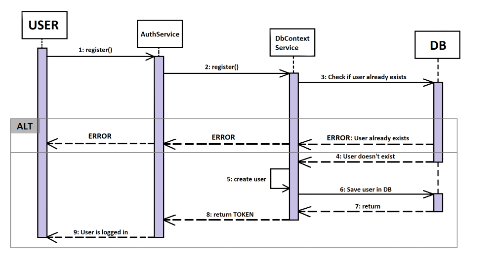

## Table of contents
- [Table of contents](#table-of-contents)
- [Introduction](#1-introduction)
    - [Purpose and Scope](#11-purpose-and-scope)
    - [Definitions, Acronyms and Abbreviations](#12-definitions-acronyms-and-abbreviations)
    - [References](#13-references)
    - [Overview](#14-overview)
- [Flow of Events—Design](#2-flow-of-eventsdesign)
- [Derived Requirements](#3-derived-requirements)

## 1. Introduction
### 1.1 Purpose and Scope
This Use-Case-Realization Specification decribes how the use case "Register" is handled and what processes and interactions are exchanged within the use case.

### 1.2 Definitions, Acronyms, and Abbreviations
| Abbreviation  | Explanation                               |
|---------------|-------------------------------------------|
| UMLSD         | UML sequence diagramm                     |
| DB            | Data Base                                 |

### 1.3 References
| Title                                                         | Date       | Publisher |
|---------------------------------------------------------------|------------|-----------|
| [AMOGUS Blog](https://github.com/CUMGroup/AMOGUS/discussions) | 26.10.2022 | CUMGroup  |
| [Github](https://github.com/CUMGroup/AMOGUS/)                 | 26.10.2022 | CUMGroup  |

### 1.4 Overview
In the following the flow of events is described supported by a UMLSD. This document ends with the description of the derived requirements.

## 2. Flow of Events—Design 
</img> 
The user fills in the registration form and sends a request to the authentication service. This request is forwarded to the server which will check in the DB wheter the user already exists (username or email) or not. If the user already exists then an Error is returned and the registration process is canceled. On the other hand, if the user doen't exist yet the server will create a new user, store it in the DB and answer the Authentication service with the token for the user. The user is now logged into is newly created account.

## 3. Derived Requirements
- account-system
- authorization-system
- authentication-system
