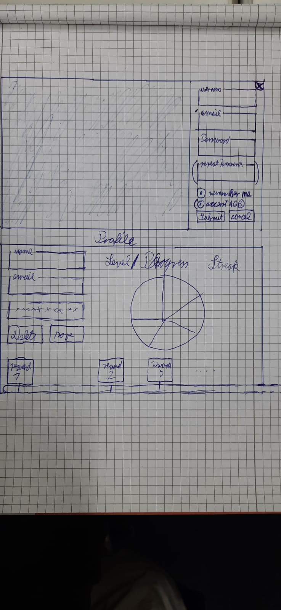

## 1. Brief Description
This use case will allow a user with an account to log in to it.
## 2. GUI Mockup
</img>

## 3. Flow of Events
</img>
## 4. Special Requirements
The user already has an account.
## 5. Preconditions
1. The user is not logged in yet
2. The user visits the login page
## 6. Postconditions
The Server has checked the credentials and the user is now logged in. (if credentials were correct)
## 7. Effort Estimation
13 Story Points
