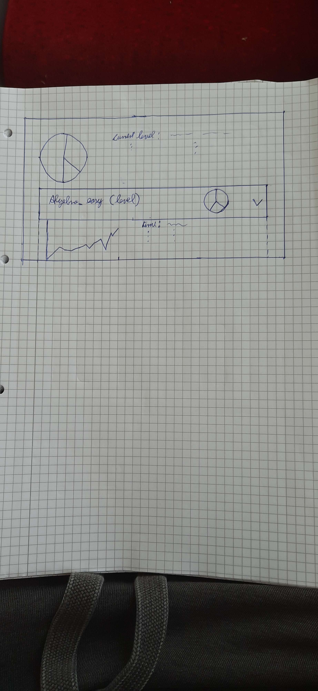

## 1. Brief Description
This use case allows tracking statistics of the games a user played
## 2. GUI Mockup
</img>
## 3. Flow of Events
TBD
## 4. Special Requirements
/ 
## 5. Preconditions
1. The user is logged in
2. The user plays games
## 6. Postconditions
The Backend tracks the game information:
- current level
- questions answered
- correct / incorrect answers
- correct / incorrect answers ratio
- time played
- time per question
- quickest answer
- slowest answer
- longest streak
- answers per day
- correct answers per day
- answers per category 
See the [Stats specification file](/documents/gameplay/plots_statstracking.pdf) 
Data will be displayed in the view
## 7. Effort Estimation
